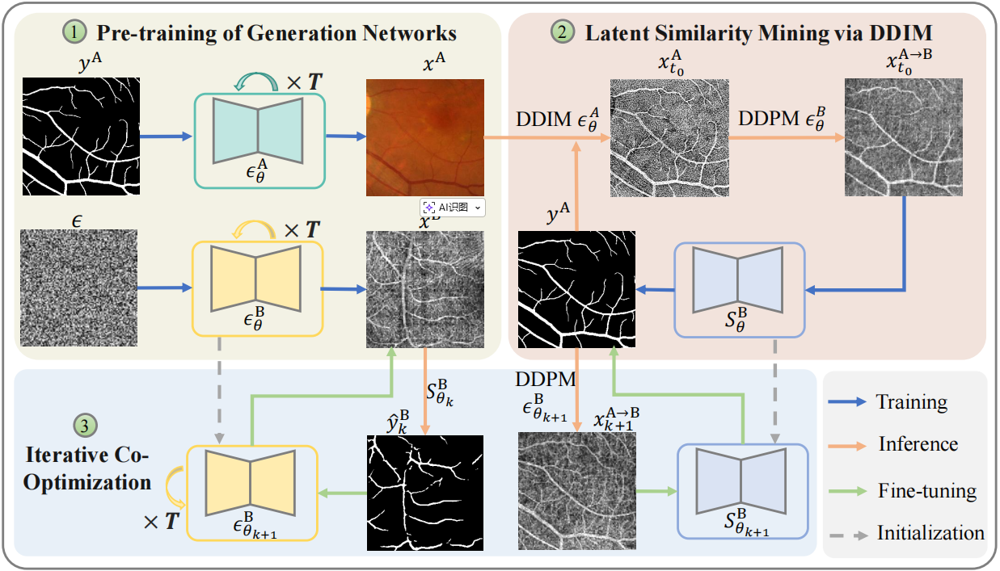

# Cross-Domain Vessel Segmentation via Latent Similarity Mining and Iterative Co-Optimization<!--参考https://github.com/HeliosZhao/NCDSS/blob/master/README.md-->


This repository contains the official implementation of our paper:

> **Cross-Domain Vessel Segmentation via Latent Similarity Mining and Iterative Co-Optimization, IEEE International Symposium on Biomedical Imaging 2026**
> 
> Zhanqiang Guo, [Jianjiang Feng](http://ivg.au.tsinghua.edu.cn/~jfeng/), Jie Zhou

> Paper: <!--[tsinghua.edu.cn](http://ivg.au.tsinghua.edu.cn/~jfeng/pubs/Guo_ISBI24_VesselScribble.pdf)-->

> **Abstract:** Retinal vessel segmentation serves as a critical prerequisite for automated diagnosis of retinal pathologies. While recent advances in Convolutional Neural Networks (CNNs) have demonstrated promising performance in this task, significant performance degradation occurs when domain shifts exist between training and testing data. This challenge is exacerbated by the sparse distribution and intricate local details of retinal vasculature. To address these limitations, we propose a novel domain transfer framework that leverages latent vascular similarity across domains and iterative co-optimization of generation and segmentation networks. Specifically, we first pre-train generation networks for source and target domains. Subsequently, the pretrained source-domain conditional diffusion model performs deterministic inversion to establish intermediate latent representations of vascular images, creating domain-agnostic prototypes for target synthesis. Finally, we develop an iterative refinement strategy where segmentation network and generative model undergo mutual optimization through cyclic parameter updating. This co-evolution process enables simultaneous enhancement of cross-domain image synthesis quality and segmentation accuracy. Experiments demonstrate that our framework achieves state-of-the-art performance in cross-domain retinal vessel segmentation, particularly in challenging clinical scenarios with significant modality discrepancies.
<br>
<p align="center">
     <br />
    <em>
    Illustration of The Proposed Framework.
    </em>
</p>
<br>

## News
- **[Jan 16 2026]** :bell: Code is coming. 

## Requirements

* Python = 3.11
* Pytorch = 2.1.2
* CUDA = 12.4
* Install other packages in `requirements.txt`

## Data preparation

The file structure is as follows:
```shell
root_path/dataset/
    ├── FIVES/
    │   ├── Original/
    │   └── Ground_truth/
    └── OCTA-500/
        ├── Original/
        └── Ground_truth/

## Run

### Stage1
* **Training Generation Model**. 
    ```shell
    mpiexec -n 2 python scripts/image_train.py --data_dir root_path/dataset/FIVES/ --vessel_label True --label_path Ground_truth/ #save to source_generation_model
    mpiexec -n 2 python scripts/image_train.py --data_dir root_path/dataset/OCTA-500/ --vessel_label False --label_path Ground_truth/ #save to target_generation_model
    ```
* **Latent Similarity Mining via DDIM**. 
    ```shell
    python scripts/sample_t0.py --data_dir root_path/dataset/FIVES/ --vessel_label True --model_path source_generation_model #save to t0_data_path
    python scripts/sample_t02target.py --data_dir t0_data_path --model_path target_generation_model  #save to iter0_generation_path
    ```

* **Target Segmentation Model**. 
    ```shell
    python scripts/segment_target.py --train 1 --generated_path iter0_generation_path #save to iter0_segmentation_model
    ython scripts/segment_target.py --train 0 --load_name iter0_segmentation_model --data_path root_path/dataset/OCTA-500/ --iter_num 0 #segmentaion result: root_path/dataset/OCTA-500/Temp_result_0/
    ```

### Stage2: iter_num=n
* **Iterative Co-Optimization: Generation**. 
    ```shell
    mpiexec -n 2 python scripts/image_train.py --data_dir /data/guozhanqiang/binary2gray/fives/OCTA-500/ --vessel_label True --label_path Temp_result_{n-1}/ #save to target_generation_model_{n}
    python scripts/image_sample_same.py --data_dir iter0_generation_path --model_path target_generation_model_{n} #iter{n}_generation_path
    ```

* **Iterative Co-Optimization: Segmentaion**. 
    ```shell
    python scripts/segment_target.py --train 1 --generated_path iter{n}_generation_path #save to iter{n}_segmentation_model
    ython scripts/segment_target.py --train 0 --load_name iter{n}_segmentation_model --data_path root_path/dataset/OCTA-500/ --iter_num 0 #segmentaion result: root_path/dataset/OCTA-500/Temp_result_{n}/
    ```

We hope you find our work useful. If you would like to acknowledge it in your project, please use the following citation:
```
```

## Contact me

If you have any questions about this code, please do not hesitate to contact me.

Zhanqiang Guo: guozq21@mails.tsinghua.edu.cn